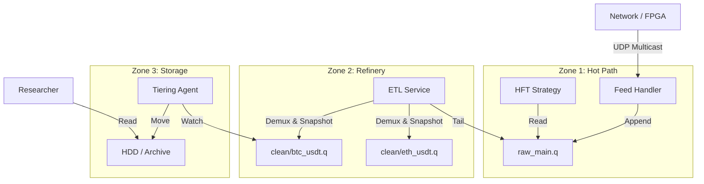

# Unified Storage & ETL Architecture

## 1. The Philosophy

1.  **Latency First (Production):** The Hot Path must never pay the cost of organization. Data is written exactly as it arrives (Multiplexed, Raw).
2.  **Usability Second (Research):** Research efficiency comes from Structure (Demultiplexed, Clean). We bridge this gap with an asynchronous, near-line transformation layer.
3.  **Storage is Stream:** There is no separate "Database." The Archive is simply the set of Sealed Segments from the Clean Streams. Access is unified via the Chronicle API.
4.  **Synthetic State:** Snapshots are expensive. We offload their generation to the ETL layer, keeping the Hot Path lightweight while ensuring the Archive is seek-friendly.

---

## 2. The Topology

The system is divided into three distinct zones based on latency and data temperature.

### Zone 1: The Firehose (Hot / Critical Path)
*   **Component:** `chronicle-feed` (Feed Handler).
*   **Medium:** `/dev/shm` (Ramdisk) or `/mnt/nvme-hot`.
*   **Stream:** `/queues/raw_main.q`
*   **Characteristics:**
    *   **Multiplexed:** All symbols, all message types (Book, Trade, System).
    *   **Raw:** Minimal parsing/normalization.
    *   **Sparse Snapshots:** Only writes snapshots on process start or feed reconnect.
    *   **Retention:** Short (e.g., 24-48 hours). Used for live trading and immediate replay.

### Zone 2: The Refinery (Warm / Near-Line)
*   **Component:** `chronicle::etl` (Transformation Engine).
*   **Input:** Tails `/queues/raw_main.q`.
*   **Operation:**
    1.  **Demultiplex:** Filters messages by Symbol and Type.
    2.  **State Reconstruction:** Maintains internal Order Book state for all symbols.
    3.  **Snapshot Injection:** Periodically (e.g., every 60s) serializes internal state as a `Snapshot` message into the output stream.
*   **Output:** Writes to Structured Queues:
    *   `/queues/clean/btc_usdt/book.q`
    *   `/queues/clean/btc_usdt/trade.q`
    *   `/queues/clean/eth_usdt/book.q`
*   **Characteristics:**
    *   **Latency:** Milliseconds behind Live.
    *   **Seekable:** Frequent snapshots allow fast random access.

### Zone 3: The Archive (Cold / Research)
*   **Component:** `chronicle::storage` (Tiering Agent).
*   **Input:** Watches `/queues/clean/...` for Sealed Segments.
*   **Operation:**
    *   **Migrate:** Moves sealed `.q` files from NVMe to HDD/S3/NFS.
    *   **Index:** Updates a `Manifest` for the `StorageReader` to locate files.
    *   **Compress:** (Optional) Transcodes `.q` to `.q.zst` if CPU allows, or relies on filesystem compression (ZFS/Btrfs).
*   **Access:** Researchers mount the Archive and use `chronicle::core` to read files transparently.

---

## 3. The Data Flow

---

## 4. The Critical Path Analysis

### Scenario: "Live Trading"
1.  **Packet In:** Feed Handler receives UDP packet (Sequence 100).
2.  **Write:** Appends to `raw_main.q`. Atomic Commit. **Latency: < 1µs.**
3.  **Reaction:** HFT Strategy sees update. Fires order.
4.  **End of Path:** The latency loop closes here.

### Scenario: "The ETL Pipeline" (Async)
1.  **Wake:** `chronicle::etl` reader wakes up (approx 5-50µs later).
2.  **Process:** Reads Sequence 100. Updates internal `HashMap<Symbol, OrderBook>`.
3.  **Check:** "Is it time for a Snapshot?" (e.g., `LastSnapshot + 60s < Now`).
    *   **Yes:** Serialize OrderBook -> Append Snapshot Msg -> Append Delta Msg.
    *   **No:** Append Delta Msg.
4.  **Write:** Appends to `clean/btc_usdt.q`.

### Scenario: "Research Query"
1.  **Request:** "Get BTC Order Book at 10:00:00."
2.  **Locate:** `StorageReader` checks `clean/btc_usdt/index.meta` (or cached manifest).
3.  **Seek:** Finds Segment `N`. Uses SeekIndex to jump to 10:00:00.
4.  **Scan Back:** Finds nearest Snapshot (guaranteed within 60s by ETL).
5.  **Reconstruct:** Loads Snapshot, replays Deltas to 10:00:00.
6.  **Yield:** Returns Book State.

---

## 5. Component Specifications

### A. `chronicle-feed` (Existing)
*   **Role:** Dumb Pipe.
*   **Logic:** Normalize Protocol -> Binary Struct -> Append.
*   **No Filtering.**

### B. `chronicle::etl` (New)
*   **Role:** The Smart Bridge.
*   **Architecture:**
    *   **Single-Threaded Pipelining:** To maintain strict ordering.
    *   **Sharded:** If throughput > Single Core, shard by Symbol Group (e.g., ETL-A handles BTC*, ETL-B handles ETH*).
*   **State:**
    *   Must handle `Gap Detection` and `Feed Recovery` gracefully.
    *   If Raw Stream gaps, ETL writes a `Gap` marker or resets the Snapshot.

### C. `chronicle::storage` (Refactored)
*   **Role:** Librarian.
*   **Logic:**
    *   `TierManager`: Configurable policies (`Hot -> Warm` after 2h, `Warm -> Cold` after 7d).
    *   `Manifest`: JSON/SQLite index mapping `(Symbol, Date) -> [Segment Paths]`.
    *   **Zero-Copy Move:** Uses `rename()` whenever possible to avoid data copy overhead during tiering.

---

## 6. Implementation Plan

1.  **Phase 1: The ETL Engine**
    *   Build `chronicle-etl` binary (in the `chronicle` crate).
    *   Implement `OrderBook` reconstruction logic (in-memory).
    *   Implement `Snapshot` injection policy.

2.  **Phase 2: The Storage Tiering**
    *   Refactor `chronicle::storage` to drop `ArchiveTap`.
    *   Implement `TierManager` (background thread).
    *   Implement basic file-system based tiering (moving `.q` files).

3.  **Phase 3: The Unified Reader**
    *   Update `chronicle::core` Reader or create `chronicle-access` crate.
    *   Implement `MultiSegmentReader` that spans tiers transparently.
